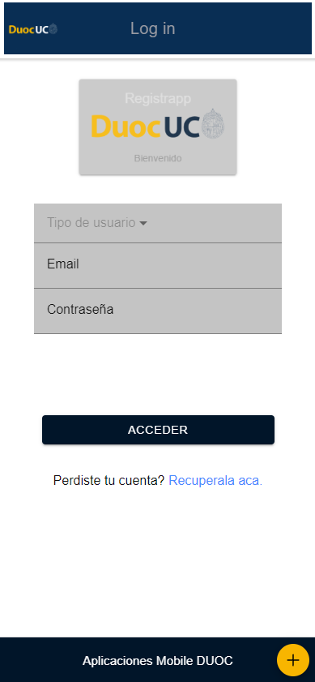
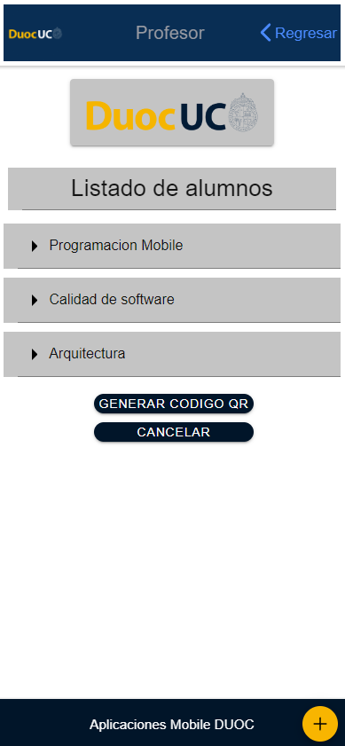
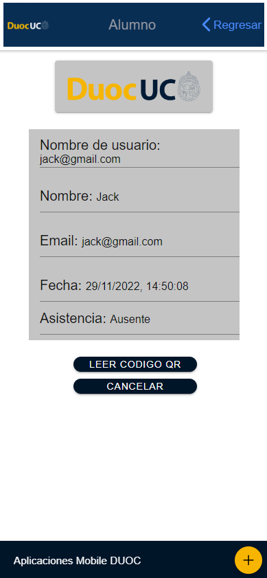

# Registrapp
La aplicación Registrapp fue creada para la asignatura Programacion de Aplicaciones Mobile del DuocUC.
Fue escrita en typescript usando el framework Ionic con Angular.
Su función es para registrar asistencia de alumnos, se puede ingresar al sistema como alumno o como profesor, para registrar una asistencia o para desplegar la lista de alumnos con su estado de asistencia.
En este caso no fue implementada una base de datos, ya que vimos API REST, por lo tanto la actualización de datos es mediante peticiones http.
 
A continuación se presentarán las pantallas de la aplicación con una breve descripción:

Pantalla principal:
Esta pantalla contiene un login que funciona con un servicio de authenticación llamado authentication guard, se puede ingresar como alumno o como profesor.

Pantalla de profesor:
Esta pantalla contiene listados de alumnos, en este caso se uso el mismo json para todos los listados, los valores de la lista se obtienen mediante una petición GET.
Además contiene un generador de código QR para que un alumno lo escanee desde el celular para registrar su asistencia.

Pantalla alumno:
Esta pantalla contiene los datos del alumno que ingresó y la función para registrar la asistencia utilizando la cámara para leer un código qr.

Pantalla de profesor PC:

La idea es desplegar el código QR en un proyector para que los alumnos lo lean usando sus celulares, es por eso que se muestra la patalla del PC.

